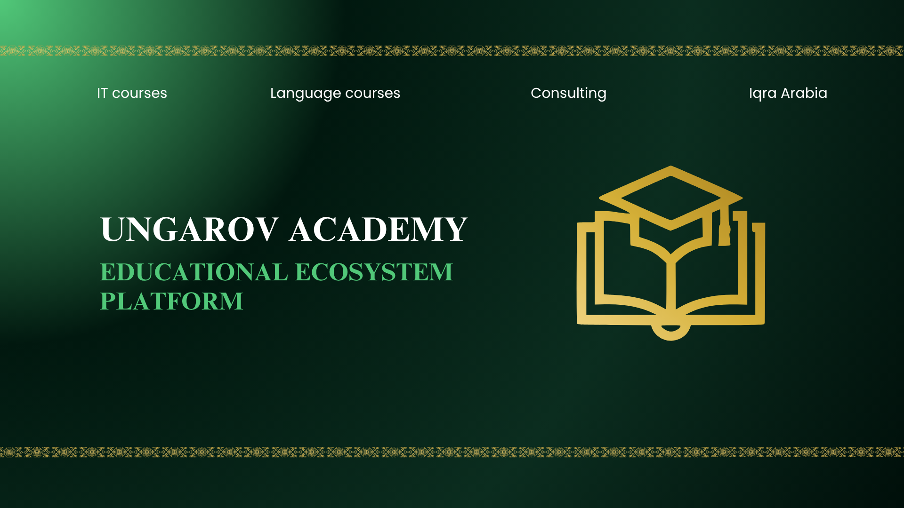

<div align="center"> 
  
<h1>Ungarov Academy — Educational Ecosystem Platform</h1> 

<!-- Banner -->


<h2>A Next-Generation Full-Stack LMS & Consulting Ecosystem</h2>

[](https://nextjs.org/)
[](https://www.typescriptlang.org/)
[](https://www.mongodb.com/)
[](https://stripe.com/)
[](https://clerk.com/)


</div>

---

## 📌 Overview

**Ungarov Academy** is a comprehensive, multi-directional digital learning ecosystem built on a modern Full-Stack architecture. The platform unifies IT engineering, language acquisition, corporate consulting, and specialized international educational programs into a seamlessly integrated online portal.

### 🌟 Core Pillars:
* **💻 IT & Software Engineering:** Professional courses covering full-stack web development and modern tech stacks.
* **🌐 Language Studies:** Interactive foreign language programs designed for global communication.
* **💼 Corporate Consulting:** Specialized services for personal growth and organizational strategy.
* **🕋 Makkah Education (Iqro Arabia):** Academic mentorship and Arabic language programs tailored for studying in Makkah.

---

## 🔥 Key Features

* **🔐 Authentication & User Roles:** Secure sign-in, role management, and social logins powered by Clerk.
* **💳 Automated Payments:** Seamless checkouts, course purchases, and subscription workflows via Stripe.
* **🌐 Multilingual Support:** Built-in internationalization powered by `next-intl` and `react-i18next`.
* **📺 Secure Video Streaming:** High-performance video delivery integrated with Vimeo Player.
* **📁 Media & File Handling:** Fast asset uploads for course materials and assignments using UploadThing.
* **📊 Drag-and-Drop Course Builder:** Intuitive chapter reordering for instructors using `@hello-pangea/dnd`.
* **⚡ Real-Time Data Flow:** Scalable data storage and real-time synchronization with MongoDB, Mongoose, and Convex.
* **🎨 Premium UI/UX:** Responsive Dark/Light interface built with Tailwind CSS, Radix UI, and Liquid Glass styling.

---

## 🛠️ Tech Stack

<div width="100%">

| Category &nbsp;&nbsp;&nbsp;&nbsp;&nbsp;&nbsp;&nbsp;&nbsp;&nbsp;&nbsp;&nbsp;&nbsp;&nbsp;&nbsp;&nbsp;&nbsp;&nbsp;&nbsp;&nbsp;&nbsp;&nbsp;&nbsp;&nbsp;&nbsp;&nbsp;&nbsp;&nbsp;&nbsp;&nbsp;&nbsp;&nbsp;&nbsp;&nbsp;&nbsp;&nbsp;&nbsp;&nbsp;&nbsp;&nbsp;&nbsp;&nbsp;&nbsp;&nbsp;&nbsp;&nbsp;&nbsp;&nbsp;&nbsp;&nbsp;&nbsp;&nbsp;&nbsp;&nbsp;&nbsp;&nbsp;&nbsp;&nbsp;&nbsp;&nbsp;&nbsp;&nbsp;&nbsp;&nbsp;&nbsp; | Technologies &nbsp;&nbsp;&nbsp;&nbsp;&nbsp;&nbsp;&nbsp;&nbsp;&nbsp;&nbsp;&nbsp;&nbsp;&nbsp;&nbsp;&nbsp;&nbsp;&nbsp;&nbsp;&nbsp;&nbsp;&nbsp;&nbsp;&nbsp;&nbsp;&nbsp;&nbsp;&nbsp;&nbsp;&nbsp;&nbsp;&nbsp;&nbsp;&nbsp;&nbsp;&nbsp;&nbsp;&nbsp;&nbsp;&nbsp;&nbsp;&nbsp;&nbsp;&nbsp;&nbsp;&nbsp;&nbsp;&nbsp;&nbsp;&nbsp;&nbsp;&nbsp;&nbsp;&nbsp;&nbsp;&nbsp;&nbsp;&nbsp;&nbsp;&nbsp;&nbsp;&nbsp;&nbsp;&nbsp;&nbsp;&nbsp;&nbsp;&nbsp;&nbsp;&nbsp;&nbsp;&nbsp;&nbsp;&nbsp;&nbsp;&nbsp;&nbsp;&nbsp;&nbsp;&nbsp;&nbsp;&nbsp;&nbsp;&nbsp;&nbsp;&nbsp;&nbsp;&nbsp;&nbsp;&nbsp;&nbsp;&nbsp;&nbsp;&nbsp;&nbsp;&nbsp;&nbsp;&nbsp;&nbsp;&nbsp;&nbsp;&nbsp;&nbsp;&nbsp;&nbsp;&nbsp;&nbsp;&nbsp;&nbsp;&nbsp; |
| :--- | :--- |
| **Framework & Core** | Next.js 14 (App Router), React 18, TypeScript |
| **UI & Styling** | Tailwind CSS, Shadcn UI, Radix UI, Lucide Icons |
| **Database & Realtime** | MongoDB, Mongoose, Convex |
| **Authentication** | Clerk Auth (`@clerk/nextjs`) |
| **Payment Gateway** | Stripe API, `@stripe/react-stripe-js` |
| **Internationalization** | `next-intl`, `i18next`, `react-i18next` |
| **Forms & Validation** | React Hook Form, Zod |
| **State Management** | Zustand |

</div>

---

## 🚀 Getting Started

Follow these steps to set up the project locally:

**1. Clone the repository:**
```bash
git clone https://github.com/jasurungarov/ungarov.academy
```
**2. Install dependencies:**
```bash 
npm install
```

**3. Set up environment variables:**
```bash
#CLERK AUTHORIZATION
NEXT_PUBLIC_CLERK_PUBLISHABLE_KEY=
CLERK_SECRET_KEY=
NEXT_CLERK_WEBHOOK_SECRET=

NEXT_PUBLIC_CLERK_SIGN_IN_URL=
NEXT_PUBLIC_CLERK_SIGN_UP_URL=
NEXT_PUBLIC_CLERK_AFTER_SIGN_IN_URL=
NEXT_PUBLIC_CLERK_AFTER_SIGN_UP_URL=

# TELEGRAM BOT INTEGRATION
NEXT_PUBLIC_TELEGRAM_BOT_API=
NEXT_PUBLIC_TELEGRAM_CHAT_ID=

# MONGODB DATABASE
MONGODB_URL=
MONGODB_DB=

# UPLOADTHING MEDIA UPLOAD
UPLOADTHING_TOKEN=

# TINY EDITOR 
NEXT_PUBLIC_TINY_API_KEY=

# BASE URL
NEXT_PUBLIC_BASE_URL=

# STRIPE PAYMENTS
NEXT_PUBLIC_STRIPE_PUBLISHABLE_KEY=
NEXT_PUBLIC_STRIPE_SECRET_KEY=

# OPENAI INTEGRATION
OPENAI_API_KEY
```
**4. Run the development server:**
```bash
npm run dev
```

---

# 📝 Available Scripts
**Starts the development server**
```bash
npm run dev
```
**Builds the application for production**
```bash
npm run build
```

**Runs the compiled production build**
```bash
npm run start
```
**Runs ESLint to check for code formatting errors**
```bash
npm run lint
```
**Executes TypeScript type checking**
```bash
npm run tsc
```

---

# Developed by Ungarov Academy Team

---
